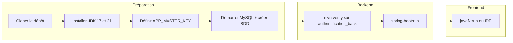
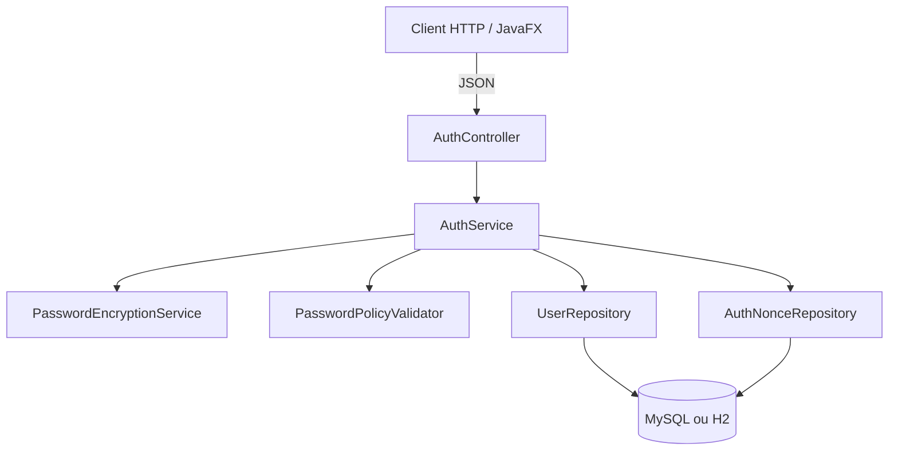
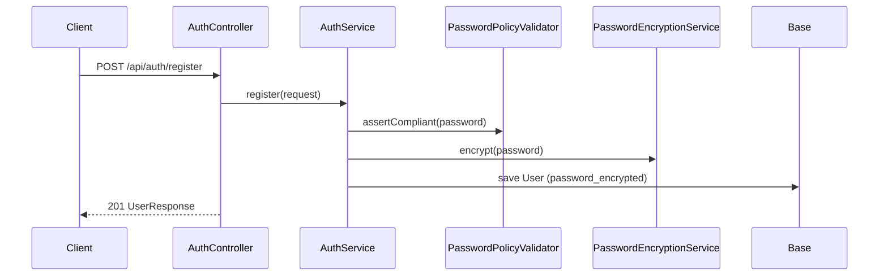
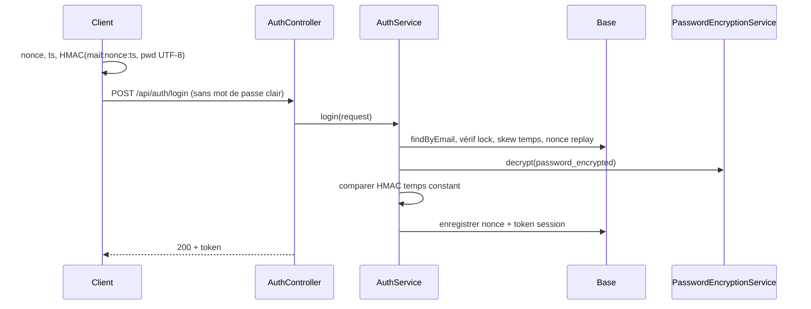
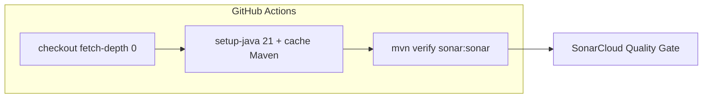

# Guide projet — authentification (référence détaillée)

Ce document est le **guide de référence** pour ton dépôt : structure réelle du code, flux complets, commandes, intégration continue, et **extraits de code alignés sur l’état actuel** du projet (`authentification_back` + `authentification_front`).

> **Note :** si un fichier change dans Git, le code « fait foi » dans l’IDE ; ce guide indique les chemins exacts pour t’y retrouver.

---

## Table des matières

1. [Vue d’ensemble](#1-vue-densemble)
2. [Prérequis et versions Java](#2-prérequis-et-versions-java)
3. [Structure du dépôt (Maven)](#3-structure-du-dépôt-maven)
4. [Workflow global (du clone au déploiement local)](#4-workflow-global-du-clone-au-déploiement-local)
5. [Évolution pédagogique TP1 → TP4](#5-évolution-pédagogique-tp1--tp4)
6. [Architecture backend](#6-architecture-backend)
7. [API REST (contrat actuel)](#7-api-rest-contrat-actuel)
8. [Flux métier détaillés](#8-flux-métier-détaillés)
9. [Cryptographie : HMAC (TP3) et chiffrement (TP4)](#9-cryptographie--hmac-tp3-et-chiffrement-tp4)
10. [Code source commenté (fichiers clés)](#10-code-source-commenté-fichiers-clés)
11. [Client JavaFX](#11-client-javafx)
12. [Tests automatisés](#12-tests-automatisés)
13. [Commandes Maven utiles](#13-commandes-maven-utiles)
14. [CI GitHub Actions + SonarCloud](#14-ci-github-actions--sonarcloud)
15. [Dépannage fréquent](#15-dépannage-fréquent)
16. [Liens vers les autres guides](#16-liens-vers-les-autres-guides)

---

## 1. Vue d’ensemble

Le dépôt est un **réacteur Maven** à la racine : deux modules applicatifs, **aucun module `authentification-common`** (la classe utilitaire `SsoHmac` est **dupliquée** dans le back et le front pour garder le même protocole TP3 sans dépendance Maven partagée).

| Module | Technologie | Rôle |
|--------|-------------|------|
| `authentification-parent` (POM racine) | Maven `packaging=pom` | Ordonne la compilation, JaCoCo agrégé pour Sonar, plugin Sonar. |
| `authentification_back` | Spring Boot 4, JPA, MySQL/H2 | API REST : inscription, login **HMAC**, profil `/api/me`, chiffrement AES-GCM des mots de passe (TP4). |
| `authentification_front` | JavaFX, JPMS (`module-info.java`) | Client bureau : HTTP vers le back, même logique HMAC que le serveur. |

---

## 2. Prérequis et versions Java

| Contexte | Version Java | Pourquoi |
|----------|--------------|----------|
| **Backend** (`authentification_back`) | **17** (`<java.version>17</java.version>` dans son `pom.xml`) | Alignement énoncé / Spring. |
| **Frontend** (`authentification_front`) | **21** (`source` / `target` 21 dans son `pom.xml`) | JavaFX et toolchain du module. |
| **CI** (`.github/workflows/ci.yml`) | **21** | Le JDK du runner compile **les deux** modules dans un seul `mvn verify`. |

En local, tu peux lancer le back avec JDK 17 uniquement ; pour compiler **tout** le réacteur, utilise **JDK 21** (comme en CI) ou compile module par module.

### Variable obligatoire TP4

Sans **`APP_MASTER_KEY`** (non vide), le bean `PasswordEncryptionService` lève une exception au démarrage : l’application **ne démarre pas**.

Exemple PowerShell avant `spring-boot:run` ou les tests hors Surefire :

```powershell
$env:APP_MASTER_KEY = "ta-cle-longue-aleatoire"
```

Les tests du backend injectent déjà une clé factice via `maven-surefire-plugin` → `environmentVariables` dans `authentification_back/pom.xml`.

---

## 3. Structure du dépôt (Maven)

Arborescence utile (simplifiée) :

```text
authentification/
├── pom.xml                          # Parent : modules back + front, propriétés Sonar
├── authentification_back/
│   ├── pom.xml
│   └── src/main/java/com/example/authentification_back/
│       ├── AuthentificationBackApplication.java
│       ├── config/                  # Propriétés sécurité, seed compte test, CORS…
│       ├── controller/AuthController.java
│       ├── dto/                     # RegisterRequest, LoginRequest (TP3), UserResponse…
│       ├── entity/                  # User, AuthNonce
│       ├── exception/               # + GlobalExceptionHandler
│       ├── repository/
│       ├── security/                # PasswordEncryptionService, SsoHmac
│       ├── service/AuthService.java
│       └── validation/
│   └── src/main/resources/application.properties
├── authentification_front/
│   ├── pom.xml
│   └── src/main/java/
│       ├── module-info.java
│       └── com/example/authentification_front/
│           ├── api/AuthApiClient.java
│           ├── security/SsoHmac.java   # même protocole que le back (copie locale)
│           └── …
└── Doc/Guide/                       # Guides pédagogiques
```

### 3.1 POM parent (réacteur)

Fichier racine : `pom.xml`.

```xml
<?xml version="1.0" encoding="UTF-8"?>
<project xmlns="http://maven.apache.org/POM/4.0.0"
         xmlns:xsi="http://www.w3.org/2001/XMLSchema-instance"
         xsi:schemaLocation="http://maven.apache.org/POM/4.0.0 https://maven.apache.org/xsd/maven-4.0.0.xsd">
    <modelVersion>4.0.0</modelVersion>

    <groupId>com.example</groupId>
    <artifactId>authentification-parent</artifactId>
    <version>1.0-SNAPSHOT</version>
    <packaging>pom</packaging>
    <name>authentification parent</name>

    <modules>
        <module>authentification_back</module>
        <module>authentification_front</module>
    </modules>

    <properties>
        <sonar.organization>mirija-712</sonar.organization>
        <sonar.projectKey>mirija-712_authentification-java</sonar.projectKey>
        <sonar.host.url>https://sonarcloud.io</sonar.host.url>
        <sonar.sourceEncoding>UTF-8</sonar.sourceEncoding>
        <sonar.coverage.jacoco.xmlReportPaths>
            ${maven.multiModuleProjectDirectory}/authentification_back/target/site/jacoco/jacoco.xml,
            ${maven.multiModuleProjectDirectory}/authentification_front/target/site/jacoco/jacoco.xml
        </sonar.coverage.jacoco.xmlReportPaths>
    </properties>

    <build>
        <plugins>
            <plugin>
                <groupId>org.sonarsource.scanner.maven</groupId>
                <artifactId>sonar-maven-plugin</artifactId>
                <version>3.11.0.3922</version>
            </plugin>
        </plugins>
    </build>
</project>
```

---

## 4. Workflow global (du clone au déploiement local)

### 4.1 Diagramme — journée type développeur



### 4.2 Ordre d’exécution manuel

1. **MySQL** : base `authentification` (URL typique dans `application.properties`, port **3307** dans le fichier livré — adapte si besoin).
2. **Backend** : `cd authentification_back` puis `mvn spring-boot:run` avec `APP_MASTER_KEY` défini.
3. **Frontend** : `cd authentification_front` puis `mvn javafx:run` ; URL API par défaut `http://localhost:8080`.

---

## 5. Évolution pédagogique TP1 → TP4

| TP | Idée principale | État dans le code actuel |
|----|-----------------|---------------------------|
| **TP1** | API REST, jeton en base, erreurs JSON uniformes | Base des contrôleurs / `GlobalExceptionHandler` (évolution). |
| **TP2** | Politique de mot de passe forte, verrouillage après échecs | `PasswordPolicyValidator`, champs `failed_login_attempts` / `lock_until` sur `User`. |
| **TP3** | Login **sans** mot de passe sur le fil : **nonce + timestamp + HMAC** | `LoginRequest`, table `auth_nonce`, `SsoHmac`, client `AuthApiClient.login`. |
| **TP4** | Mot de passe stocké **chiffré** (réversible) avec **`APP_MASTER_KEY`** | `password_encrypted`, `PasswordEncryptionService` (AES-GCM `v1:…`). |

> Le guide **[GUIDE_TP2.md](./GUIDE_TP2.md)** décrit surtout l’ère **BCrypt + mot de passe dans le POST /login** : utile pour l’histoire du cours ; le **comportement actuel du login** est **TP3 + TP4** (décrit ici et dans TP3/TP4).

---

## 6. Architecture backend



---

## 7. API REST (contrat actuel)

| Méthode | Chemin | Corps / en-têtes | Succès |
|---------|--------|------------------|--------|
| `POST` | `/api/auth/register` | JSON `email`, `password`, `passwordConfirm` | **201** + profil (sans `token` dans le JSON grâce à `@JsonInclude`) |
| `POST` | `/api/auth/login` | JSON `email`, `nonce`, `timestamp`, `hmac` | **200** + `token` |
| `GET` | `/api/me` | `Authorization: Bearer <token>` ou `X-Auth-Token` | **200** + profil |

**Erreurs typiques :** 400 validation, 401 identifiants / token, 409 email déjà pris, 423 compte verrouillé.

---

## 8. Flux métier détaillés

### 8.1 Inscription



### 8.2 Connexion SSO (TP3) avec stockage TP4



---

## 9. Cryptographie : HMAC (TP3) et chiffrement (TP4)

### 9.1 `SsoHmac` (deux copies indépendantes)

- **Backend :** `authentification_back/.../security/SsoHmac.java`
- **Frontend :** `authentification_front/.../security/SsoHmac.java`

Les deux implémentations doivent rester **strictement alignées** :

- **Message signé :** `emailNormalisé + ":" + nonce + ":" + timestampEpochSeconds`
- **Normalisation email :** `trim()` + `toLowerCase(Locale.ROOT)` (côté client **avant** `messageToSign`, identique côté serveur dans `AuthService`).
- **HMAC :** `HmacSHA256` avec clé = **octets UTF-8 du mot de passe**.
- **Sortie :** chaîne **hex** (minuscules via `HexFormat`).
- **Comparaison côté serveur :** `constantTimeEqualsHex` pour limiter les fuites par timing.

### 9.2 `PasswordEncryptionService` (TP4 seulement)

- **Entrée config :** `APP_MASTER_KEY` (Spring `@Value("${APP_MASTER_KEY:}")`).
- **Dérivation :** SHA-256 de la master key → clé AES-256.
- **Format stocké :** `v1:<Base64(iv)>:<Base64(ciphertext+tag)>`.

---

## 10. Code source commenté (fichiers clés)

Les blocs suivants sont des **copies** du dépôt pour lecture hors ligne.

### 10.1 Entité `User`

```1:106:authentification_back/src/main/java/com/example/authentification_back/entity/User.java
package com.example.authentification_back.entity;

import jakarta.persistence.Column;
import jakarta.persistence.Entity;
import jakarta.persistence.GeneratedValue;
import jakarta.persistence.GenerationType;
import jakarta.persistence.Id;
import jakarta.persistence.PrePersist;
import jakarta.persistence.Table;

import java.time.Instant;

/**
 * Utilisateur TP3 : mot de passe chiffré réversible (SMK) pour vérification HMAC côté serveur ;
 * lockout et jeton inchangés.
 */
@Entity
@Table(name = "users")
public class User {

	@Id
	@GeneratedValue(strategy = GenerationType.IDENTITY)
	private Long id;

	@Column(nullable = false, unique = true, length = 255)
	private String email;

	/** Mot de passe chiffré avec la SMK (énoncé TP3) — jamais en clair en base. */
	@Column(name = "password_encrypted", nullable = false, columnDefinition = "TEXT")
	private String passwordEncrypted;

	@Column(name = "created_at", nullable = false)
	private Instant createdAt;

	@Column(unique = true, length = 64)
	private String token;

	@Column(name = "failed_login_attempts", nullable = false)
	private int failedLoginAttempts = 0;

	@Column(name = "lock_until")
	private Instant lockUntil;

	@PrePersist
	void prePersist() {
		if (createdAt == null) {
			createdAt = Instant.now();
		}
	}

	public Long getId() {
		return id;
	}

	public void setId(Long id) {
		this.id = id;
	}

	public String getEmail() {
		return email;
	}

	public void setEmail(String email) {
		this.email = email;
	}

	public String getPasswordEncrypted() {
		return passwordEncrypted;
	}

	public void setPasswordEncrypted(String passwordEncrypted) {
		this.passwordEncrypted = passwordEncrypted;
	}

	public Instant getCreatedAt() {
		return createdAt;
	}

	public void setCreatedAt(Instant createdAt) {
		this.createdAt = createdAt;
	}

	public String getToken() {
		return token;
	}

	public void setToken(String token) {
		this.token = token;
	}

	public int getFailedLoginAttempts() {
		return failedLoginAttempts;
	}

	public void setFailedLoginAttempts(int failedLoginAttempts) {
		this.failedLoginAttempts = failedLoginAttempts;
	}

	public Instant getLockUntil() {
		return lockUntil;
	}

	public void setLockUntil(Instant lockUntil) {
		this.lockUntil = lockUntil;
	}
}
```

### 10.2 Entité `AuthNonce` (anti-rejeu)

```java
package com.example.authentification_back.entity;

import jakarta.persistence.Column;
import jakarta.persistence.Entity;
import jakarta.persistence.GeneratedValue;
import jakarta.persistence.GenerationType;
import jakarta.persistence.Id;
import jakarta.persistence.PrePersist;
import jakarta.persistence.Table;
import jakarta.persistence.UniqueConstraint;

import java.time.Instant;

@Entity
@Table(name = "auth_nonce", uniqueConstraints = @UniqueConstraint(name = "uk_auth_nonce_user_nonce", columnNames = {
		"user_id", "nonce"
}))
public class AuthNonce {

	@Id
	@GeneratedValue(strategy = GenerationType.IDENTITY)
	private Long id;

	@Column(name = "user_id", nullable = false)
	private Long userId;

	@Column(nullable = false, length = 128)
	private String nonce;

	@Column(name = "expires_at", nullable = false)
	private Instant expiresAt;

	@Column(nullable = false)
	private boolean consumed;

	@Column(name = "created_at", nullable = false)
	private Instant createdAt;

	@PrePersist
	void prePersist() {
		if (createdAt == null) {
			createdAt = Instant.now();
		}
	}

	public Long getId() { return id; }
	public void setId(Long id) { this.id = id; }
	public Long getUserId() { return userId; }
	public void setUserId(Long userId) { this.userId = userId; }
	public String getNonce() { return nonce; }
	public void setNonce(String nonce) { this.nonce = nonce; }
	public Instant getExpiresAt() { return expiresAt; }
	public void setExpiresAt(Instant expiresAt) { this.expiresAt = expiresAt; }
	public boolean isConsumed() { return consumed; }
	public void setConsumed(boolean consumed) { this.consumed = consumed; }
	public Instant getCreatedAt() { return createdAt; }
	public void setCreatedAt(Instant createdAt) { this.createdAt = createdAt; }
}
```

### 10.3 DTO `LoginRequest` (TP3)

```1:17:authentification_back/src/main/java/com/example/authentification_back/dto/LoginRequest.java
package com.example.authentification_back.dto;

import jakarta.validation.constraints.Email;
import jakarta.validation.constraints.NotBlank;
import jakarta.validation.constraints.NotNull;

/**
 * SSO TP3 — une seule requête : {@code email}, {@code nonce}, {@code timestamp} (epoch secondes), {@code hmac} (hex).
 * Le mot de passe ne transite pas.
 */
public record LoginRequest(
		@NotBlank @Email String email,
		@NotBlank String nonce,
		@NotNull Long timestamp,
		@NotBlank String hmac
) {
}
```

### 10.4 DTO `RegisterRequest`

```1:20:authentification_back/src/main/java/com/example/authentification_back/dto/RegisterRequest.java
package com.example.authentification_back.dto;

import jakarta.validation.constraints.Email;
import jakarta.validation.constraints.NotBlank;

public record RegisterRequest(
		@NotBlank(message = "L'email est obligatoire")
		@Email(message = "Format d'email invalide")
		String email,
		@NotBlank(message = "Le mot de passe est obligatoire")
		String password,
		@NotBlank(message = "La confirmation du mot de passe est obligatoire")
		String passwordConfirm
) {
}
```

### 10.5 `AuthController`

```1:72:authentification_back/src/main/java/com/example/authentification_back/controller/AuthController.java
package com.example.authentification_back.controller;

import com.example.authentification_back.dto.LoginRequest;
import com.example.authentification_back.dto.RegisterRequest;
import com.example.authentification_back.dto.UserResponse;
import com.example.authentification_back.service.AuthService;
import jakarta.validation.Valid;
import org.springframework.http.HttpHeaders;
import org.springframework.http.HttpStatus;
import org.springframework.http.ResponseEntity;
import org.springframework.web.bind.annotation.GetMapping;
import org.springframework.web.bind.annotation.PostMapping;
import org.springframework.web.bind.annotation.RequestBody;
import org.springframework.web.bind.annotation.RequestHeader;
import org.springframework.web.bind.annotation.RequestMapping;
import org.springframework.web.bind.annotation.RestController;

@RestController
@RequestMapping("/api")
public class AuthController {

	private final AuthService authService;

	public AuthController(AuthService authService) {
		this.authService = authService;
	}

	@PostMapping("/auth/register")
	public ResponseEntity<UserResponse> register(@Valid @RequestBody RegisterRequest request) {
		UserResponse body = authService.register(request);
		return ResponseEntity.status(HttpStatus.CREATED).body(body);
	}

	@PostMapping("/auth/login")
	public ResponseEntity<UserResponse> login(@Valid @RequestBody LoginRequest request) {
		return ResponseEntity.ok(authService.login(request));
	}

	@GetMapping("/me")
	public ResponseEntity<UserResponse> me(
			@RequestHeader(value = HttpHeaders.AUTHORIZATION, required = false) String authorization,
			@RequestHeader(value = "X-Auth-Token", required = false) String authToken) {
		String resolved = resolveToken(authorization, authToken);
		return ResponseEntity.ok(authService.currentUser(resolved));
	}

	private static String resolveToken(String authorization, String authToken) {
		String bearer = extractBearer(authorization);
		if (bearer != null && !bearer.isBlank()) {
			return bearer;
		}
		return authToken;
	}

	private static String extractBearer(String authorization) {
		if (authorization == null || authorization.isBlank()) {
			return null;
		}
		String trimmed = authorization.trim();
		if (trimmed.regionMatches(true, 0, "Bearer ", 0, 7)) {
			return trimmed.substring(7).trim();
		}
		return trimmed;
	}
}
```

### 10.6 `AuthService` (cœur métier TP3 + TP4)

```java
package com.example.authentification_back.service;

import com.example.authentification_back.config.AuthSecurityProperties;
import com.example.authentification_back.dto.LoginRequest;
import com.example.authentification_back.dto.RegisterRequest;
import com.example.authentification_back.dto.UserResponse;
import com.example.authentification_back.entity.AuthNonce;
import com.example.authentification_back.entity.User;
import com.example.authentification_back.exception.AccountLockedException;
import com.example.authentification_back.exception.AuthenticationFailedException;
import com.example.authentification_back.exception.InvalidInputException;
import com.example.authentification_back.exception.ResourceConflictException;
import com.example.authentification_back.repository.AuthNonceRepository;
import com.example.authentification_back.repository.UserRepository;
import com.example.authentification_back.security.PasswordEncryptionService;
import com.example.authentification_back.security.SsoHmac;
import com.example.authentification_back.validation.PasswordPolicyValidator;
import org.slf4j.Logger;
import org.slf4j.LoggerFactory;
import org.springframework.stereotype.Service;
import org.springframework.transaction.annotation.Transactional;

import java.time.Clock;
import java.time.Duration;
import java.time.Instant;
import java.util.Locale;
import java.util.Optional;
import java.util.UUID;

@Service
public class AuthService {

	public static final String GENERIC_LOGIN_ERROR = "Identifiants invalides";

	private static final Logger log = LoggerFactory.getLogger(AuthService.class);

	private final UserRepository userRepository;
	private final AuthNonceRepository authNonceRepository;
	private final PasswordEncryptionService passwordEncryptionService;
	private final PasswordPolicyValidator passwordPolicyValidator;
	private final AuthSecurityProperties authProperties;
	private final Clock clock;

	public AuthService(
			UserRepository userRepository,
			AuthNonceRepository authNonceRepository,
			PasswordEncryptionService passwordEncryptionService,
			PasswordPolicyValidator passwordPolicyValidator,
			AuthSecurityProperties authProperties,
			Clock clock) {
		this.userRepository = userRepository;
		this.authNonceRepository = authNonceRepository;
		this.passwordEncryptionService = passwordEncryptionService;
		this.passwordPolicyValidator = passwordPolicyValidator;
		this.authProperties = authProperties;
		this.clock = clock;
	}

	@Transactional
	public UserResponse register(RegisterRequest request) {
		String email = normalizeEmail(request.email());
		passwordPolicyValidator.assertCompliant(request.password());
		if (!request.password().equals(request.passwordConfirm())) {
			log.warn("Inscription échouée: confirmation différente pour {}", email);
			throw new InvalidInputException("Les mots de passe ne correspondent pas");
		}
		if (userRepository.existsByEmail(email)) {
			log.warn("Inscription échouée: email déjà utilisé ({})", email);
			throw new ResourceConflictException("Cet email est déjà enregistré");
		}
		User user = new User();
		user.setEmail(email);
		user.setPasswordEncrypted(passwordEncryptionService.encrypt(request.password()));
		userRepository.save(user);
		log.info("Inscription réussie pour l'utilisateur id={} email={}", user.getId(), email);
		return UserResponse.profile(user);
	}

	@Transactional(noRollbackFor = AuthenticationFailedException.class)
	public UserResponse login(LoginRequest request) {
		String email = normalizeEmail(request.email());
		Instant now = clock.instant();

		Optional<User> optUser = userRepository.findByEmail(email);
		if (optUser.isEmpty()) {
			log.warn("Connexion échouée: email non reconnu");
			throw new AuthenticationFailedException(GENERIC_LOGIN_ERROR);
		}
		User user = optUser.get();

		assertNotLocked(user, now);
		clearExpiredLockIfNeeded(user, now);

		Instant clientTs = Instant.ofEpochSecond(request.timestamp());
		long skewSeconds = Math.abs(Duration.between(now, clientTs).getSeconds());
		if (skewSeconds > authProperties.getTimestampSkewSeconds()) {
			log.warn("Connexion refusée: timestamp hors fenêtre (skew={}s)", skewSeconds);
			throw new AuthenticationFailedException(GENERIC_LOGIN_ERROR);
		}

		if (authNonceRepository.existsByUserIdAndNonce(user.getId(), request.nonce())) {
			log.warn("Connexion refusée: nonce déjà utilisé (rejeu) userId={}", user.getId());
			throw new AuthenticationFailedException(GENERIC_LOGIN_ERROR);
		}

		String plainPassword;
		try {
			plainPassword = passwordEncryptionService.decrypt(user.getPasswordEncrypted());
		} catch (Exception e) {
			log.warn("Déchiffrement impossible pour user id={}", user.getId());
			throw new AuthenticationFailedException(GENERIC_LOGIN_ERROR);
		}

		String message = SsoHmac.messageToSign(email, request.nonce(), request.timestamp());
		String expectedHex = SsoHmac.hmacSha256Hex(plainPassword, message);
		if (!SsoHmac.constantTimeEqualsHex(expectedHex, request.hmac())) {
			log.warn("Connexion échouée: HMAC incorrect (tentative {}/{})",
					user.getFailedLoginAttempts() + 1, authProperties.getMaxFailedAttempts());
			registerFailureAndThrow(user, email, now);
		}

		AuthNonce nonceRow = new AuthNonce();
		nonceRow.setUserId(user.getId());
		nonceRow.setNonce(request.nonce());
		nonceRow.setExpiresAt(now.plusSeconds(authProperties.getNonceTtlSeconds()));
		nonceRow.setConsumed(true);
		authNonceRepository.save(nonceRow);

		return grantSession(user, email);
	}

	private void assertNotLocked(User user, Instant now) {
		if (user.getLockUntil() != null && user.getLockUntil().isAfter(now)) {
			log.warn("Connexion refusée: compte verrouillé id={}", user.getId());
			throw new AccountLockedException("Compte temporairement verrouillé. Réessayez plus tard.");
		}
	}

	private void clearExpiredLockIfNeeded(User user, Instant now) {
		if (user.getLockUntil() != null && !user.getLockUntil().isAfter(now)) {
			user.setLockUntil(null);
			user.setFailedLoginAttempts(0);
			userRepository.save(user);
		}
	}

	private UserResponse grantSession(User user, String email) {
		user.setFailedLoginAttempts(0);
		user.setLockUntil(null);
		String newToken = UUID.randomUUID().toString();
		user.setToken(newToken);
		userRepository.save(user);
		log.info("Connexion réussie pour l'utilisateur id={} email={}", user.getId(), email);
		return UserResponse.login(user, newToken);
	}

	private void registerFailureAndThrow(User user, String email, Instant now) {
		int failures = user.getFailedLoginAttempts() + 1;
		user.setFailedLoginAttempts(failures);
		if (failures >= authProperties.getMaxFailedAttempts()) {
			user.setLockUntil(now.plus(authProperties.getLockDuration()));
			log.warn("Compte verrouillé après {} échecs id={} email={}", failures, user.getId(), email);
		}
		userRepository.save(user);
		log.warn("Connexion échouée: identifiants invalides (tentative {}/{})", failures, authProperties.getMaxFailedAttempts());
		throw new AuthenticationFailedException(GENERIC_LOGIN_ERROR);
	}

	@Transactional(readOnly = true)
	public UserResponse currentUser(String rawToken) {
		if (rawToken == null || rawToken.isBlank()) {
			throw new AuthenticationFailedException("Authentification requise");
		}
		String token = rawToken.trim();
		return userRepository.findByToken(token)
				.map(UserResponse::profile)
				.orElseThrow(() -> new AuthenticationFailedException("Token invalide"));
	}

	private static String normalizeEmail(String email) {
		if (email == null) {
			return "";
		}
		return email.trim().toLowerCase(Locale.ROOT);
	}
}
```

### 10.7 `SsoHmac` (backend)

```1:43:authentification_back/src/main/java/com/example/authentification_back/security/SsoHmac.java
package com.example.authentification_back.security;

import javax.crypto.Mac;
import javax.crypto.spec.SecretKeySpec;
import java.nio.charset.StandardCharsets;
import java.security.MessageDigest;
import java.util.HexFormat;

public final class SsoHmac {

	private static final String HMAC_SHA256 = "HmacSHA256";

	private SsoHmac() {
	}

	public static String messageToSign(String normalizedEmail, String nonce, long timestampEpochSeconds) {
		return normalizedEmail + ":" + nonce + ":" + timestampEpochSeconds;
	}

	public static String hmacSha256Hex(String password, String message) {
		try {
			Mac mac = Mac.getInstance(HMAC_SHA256);
			mac.init(new SecretKeySpec(password.getBytes(StandardCharsets.UTF_8), HMAC_SHA256));
			byte[] tag = mac.doFinal(message.getBytes(StandardCharsets.UTF_8));
			return HexFormat.of().formatHex(tag);
		} catch (Exception e) {
			throw new IllegalStateException("HMAC-SHA256 indisponible", e);
		}
	}

	public static boolean constantTimeEqualsHex(String aHex, String bHex) {
		if (aHex == null || bHex == null || aHex.length() != bHex.length()) {
			return false;
		}
		try {
			byte[] a = HexFormat.of().parseHex(aHex);
			byte[] b = HexFormat.of().parseHex(bHex);
			return MessageDigest.isEqual(a, b);
		} catch (IllegalArgumentException e) {
			return false;
		}
	}
}
```

### 10.8 `PasswordEncryptionService` (fichier complet)

```java
package com.example.authentification_back.security;

import org.springframework.beans.factory.annotation.Value;
import org.springframework.stereotype.Service;

import javax.crypto.Cipher;
import javax.crypto.SecretKey;
import javax.crypto.spec.GCMParameterSpec;
import javax.crypto.spec.SecretKeySpec;
import java.nio.charset.StandardCharsets;
import java.security.MessageDigest;
import java.security.SecureRandom;
import java.util.Base64;

@Service
public class PasswordEncryptionService {

	private static final String FORMAT_V1_PREFIX = "v1:";
	private static final int GCM_IV_LENGTH = 12;
	private static final int GCM_TAG_LENGTH = 128;
	private static final SecureRandom SECURE_RANDOM = new SecureRandom();

	private final SecretKey aesKey;

	public PasswordEncryptionService(@Value("${APP_MASTER_KEY:}") String appMasterKey) {
		if (appMasterKey == null || appMasterKey.isBlank()) {
			throw new IllegalStateException(
					"Variable d'environnement APP_MASTER_KEY obligatoire : définissez une clé maître (jamais en dur dans le code).");
		}
		byte[] keyBytes = sha256(appMasterKey.getBytes(StandardCharsets.UTF_8));
		this.aesKey = new SecretKeySpec(keyBytes, "AES");
	}

	private static byte[] sha256(byte[] input) {
		try {
			return MessageDigest.getInstance("SHA-256").digest(input);
		} catch (Exception e) {
			throw new IllegalStateException(e);
		}
	}

	public String encrypt(String plainPassword) {
		try {
			byte[] iv = new byte[GCM_IV_LENGTH];
			SECURE_RANDOM.nextBytes(iv);
			Cipher cipher = Cipher.getInstance("AES/GCM/NoPadding");
			cipher.init(Cipher.ENCRYPT_MODE, aesKey, new GCMParameterSpec(GCM_TAG_LENGTH, iv));
			byte[] cipherText = cipher.doFinal(plainPassword.getBytes(StandardCharsets.UTF_8));
			String ivB64 = Base64.getEncoder().encodeToString(iv);
			String ctB64 = Base64.getEncoder().encodeToString(cipherText);
			return FORMAT_V1_PREFIX + ivB64 + ":" + ctB64;
		} catch (Exception e) {
			throw new IllegalStateException("Chiffrement impossible", e);
		}
	}

	public String decrypt(String stored) {
		if (stored == null || stored.isBlank()) {
			throw new IllegalStateException("Valeur chiffrée vide");
		}
		if (stored.startsWith(FORMAT_V1_PREFIX)) {
			return decryptV1(stored);
		}
		return decryptLegacyConcatenated(stored);
	}

	private String decryptV1(String stored) {
		try {
			String payload = stored.substring(FORMAT_V1_PREFIX.length());
			int sep = payload.indexOf(':');
			if (sep < 0) {
				throw new IllegalStateException("Format v1 invalide");
			}
			byte[] iv = Base64.getDecoder().decode(payload.substring(0, sep));
			byte[] cipherText = Base64.getDecoder().decode(payload.substring(sep + 1));
			Cipher cipher = Cipher.getInstance("AES/GCM/NoPadding");
			cipher.init(Cipher.DECRYPT_MODE, aesKey, new GCMParameterSpec(GCM_TAG_LENGTH, iv));
			byte[] plain = cipher.doFinal(cipherText);
			return new String(plain, StandardCharsets.UTF_8);
		} catch (Exception e) {
			throw new IllegalStateException("Déchiffrement impossible", e);
		}
	}

	private String decryptLegacyConcatenated(String stored) {
		try {
			byte[] combined = Base64.getDecoder().decode(stored);
			byte[] iv = new byte[GCM_IV_LENGTH];
			System.arraycopy(combined, 0, iv, 0, GCM_IV_LENGTH);
			byte[] cipherText = new byte[combined.length - GCM_IV_LENGTH];
			System.arraycopy(combined, GCM_IV_LENGTH, cipherText, 0, cipherText.length);
			Cipher cipher = Cipher.getInstance("AES/GCM/NoPadding");
			cipher.init(Cipher.DECRYPT_MODE, aesKey, new GCMParameterSpec(GCM_TAG_LENGTH, iv));
			byte[] plain = cipher.doFinal(cipherText);
			return new String(plain, StandardCharsets.UTF_8);
		} catch (Exception e) {
			throw new IllegalStateException("Déchiffrement impossible", e);
		}
	}
}
```

### 10.9 `TestAccountInitializer`

```1:37:authentification_back/src/main/java/com/example/authentification_back/config/TestAccountInitializer.java
package com.example.authentification_back.config;

import com.example.authentification_back.entity.User;
import com.example.authentification_back.repository.UserRepository;
import com.example.authentification_back.security.PasswordEncryptionService;
import org.springframework.boot.CommandLineRunner;
import org.springframework.stereotype.Component;

@Component
public class TestAccountInitializer implements CommandLineRunner {

	public static final String TEST_EMAIL = "toto@example.com";

	public static final String TEST_PASSWORD_PLAIN = "Pwd1234!abcd";

	private final UserRepository userRepository;
	private final PasswordEncryptionService passwordEncryptionService;

	public TestAccountInitializer(UserRepository userRepository, PasswordEncryptionService passwordEncryptionService) {
		this.userRepository = userRepository;
		this.passwordEncryptionService = passwordEncryptionService;
	}

	@Override
	public void run(String... args) {
		if (userRepository.existsByEmail(TEST_EMAIL)) {
			return;
		}
		User user = new User();
		user.setEmail(TEST_EMAIL);
		user.setPasswordEncrypted(passwordEncryptionService.encrypt(TEST_PASSWORD_PLAIN));
		userRepository.save(user);
	}
}
```

### 10.10 Extrait `application.properties` (clés métiers)

Fichier : `authentification_back/src/main/resources/application.properties`.

```properties
app.auth.lock-duration=2m
app.auth.max-failed-attempts=5
app.auth.timestamp-skew-seconds=60
app.auth.nonce-ttl-seconds=120
# APP_MASTER_KEY uniquement via environnement — jamais commitée en clair sur un dépôt public
```

Adapte `spring.datasource.url`, `username`, `password` à ta machine ; **ne publie pas** de vrais secrets.

---

## 11. Client JavaFX

### 11.1 Module JPMS

```1:13:authentification_front/src/main/java/module-info.java
module com.example.authentification_front {
	requires javafx.controls;
	requires javafx.fxml;
	requires java.net.http;
	requires com.google.gson;
	requires jdk.httpserver;

	opens com.example.authentification_front to javafx.fxml;
	exports com.example.authentification_front;
	exports com.example.authentification_front.api;
	exports com.example.authentification_front.policy;
}
```

### 11.2 `AuthApiClient.login` (génération du HMAC)

```46:62:authentification_front/src/main/java/com/example/authentification_front/api/AuthApiClient.java
	public ApiResult<UserDto> login(String email, String password) {
		String nonce = UUID.randomUUID().toString();
		long ts = Instant.now().getEpochSecond();
		String em = email.trim().toLowerCase(Locale.ROOT);
		String msg = SsoHmac.messageToSign(em, nonce, ts);
		String hmac = SsoHmac.hmacSha256Hex(password, msg);
		String json = String.format(Locale.ROOT,
				"{\"email\":%s,\"nonce\":%s,\"timestamp\":%d,\"hmac\":%s}",
				gson.toJson(em), gson.toJson(nonce), ts, gson.toJson(hmac));
		return postJson("/api/auth/login", json, UserDto.class, 200);
	}
```

`SsoHmac` côté front est dans `authentification_front/.../security/SsoHmac.java` (**même logique** que le backend — copie à maintenir en sync).

### 11.3 `AuthApiClient` (fichier complet)

```java
package com.example.authentification_front.api;

import com.example.authentification_front.security.SsoHmac;
import com.google.gson.Gson;
import com.google.gson.JsonSyntaxException;

import java.net.URI;
import java.net.http.HttpClient;
import java.net.http.HttpRequest;
import java.net.http.HttpResponse;
import java.nio.charset.StandardCharsets;
import java.time.Duration;
import java.time.Instant;
import java.util.Locale;
import java.util.UUID;

public final class AuthApiClient {

	private final HttpClient http = HttpClient.newBuilder()
			.connectTimeout(Duration.ofSeconds(15))
			.build();
	private final Gson gson = new Gson();
	private final String baseUrl;

	public AuthApiClient(String baseUrl) {
		this.baseUrl = normalizeBase(baseUrl);
	}

	public static String normalizeBase(String baseUrl) {
		if (baseUrl == null || baseUrl.isBlank()) {
			return "http://localhost:8080";
		}
		String t = baseUrl.trim();
		return t.endsWith("/") ? t.substring(0, t.length() - 1) : t;
	}

	public ApiResult<UserDto> register(String email, String password, String passwordConfirm) {
		String json = String.format("{\"email\":%s,\"password\":%s,\"passwordConfirm\":%s}",
				gson.toJson(email), gson.toJson(password), gson.toJson(passwordConfirm));
		return postJson("/api/auth/register", json, UserDto.class, 201);
	}

	public ApiResult<UserDto> login(String email, String password) {
		String nonce = UUID.randomUUID().toString();
		long ts = Instant.now().getEpochSecond();
		String em = email.trim().toLowerCase(Locale.ROOT);
		String msg = SsoHmac.messageToSign(em, nonce, ts);
		String hmac = SsoHmac.hmacSha256Hex(password, msg);
		String json = String.format(Locale.ROOT,
				"{\"email\":%s,\"nonce\":%s,\"timestamp\":%d,\"hmac\":%s}",
				gson.toJson(em), gson.toJson(nonce), ts, gson.toJson(hmac));
		return postJson("/api/auth/login", json, UserDto.class, 200);
	}

	public ApiResult<UserDto> me(String bearerToken) {
		try {
			HttpRequest req = HttpRequest.newBuilder()
					.uri(URI.create(baseUrl + "/api/me"))
					.timeout(Duration.ofSeconds(30))
					.header("Authorization", "Bearer " + bearerToken)
					.GET()
					.build();
			HttpResponse<String> res = http.send(req, HttpResponse.BodyHandlers.ofString());
			return mapResponse(res, UserDto.class, 200);
		} catch (Exception e) {
			return new ApiResult.Err<>("Erreur réseau : " + e.getMessage(), 0);
		}
	}

	private <T> ApiResult<T> postJson(String path, String body, Class<T> okType, int expectedOk) {
		try {
			HttpRequest req = HttpRequest.newBuilder()
					.uri(URI.create(baseUrl + path))
					.timeout(Duration.ofSeconds(30))
					.header("Content-Type", "application/json")
					.POST(HttpRequest.BodyPublishers.ofString(body, StandardCharsets.UTF_8))
					.build();
			HttpResponse<String> res = http.send(req, HttpResponse.BodyHandlers.ofString());
			return mapResponse(res, okType, expectedOk);
		} catch (Exception e) {
			return new ApiResult.Err<>("Erreur réseau : " + e.getMessage(), 0);
		}
	}

	private <T> ApiResult<T> mapResponse(HttpResponse<String> res, Class<T> okType, int expectedOk) {
		int code = res.statusCode();
		String body = res.body() == null ? "" : res.body();
		if (code == expectedOk) {
			try {
				return new ApiResult.Ok<>(gson.fromJson(body, okType));
			} catch (JsonSyntaxException e) {
				return new ApiResult.Err<>("Réponse JSON invalide : " + body, code);
			}
		}
		return new ApiResult.Err<>(parseMessage(body), code);
	}

	private String parseMessage(String json) {
		if (json == null || json.isBlank()) {
			return "Erreur inconnue";
		}
		try {
			ErrorBody e = gson.fromJson(json, ErrorBody.class);
			if (e != null && e.message != null && !e.message.isBlank()) {
				return e.message;
			}
		} catch (JsonSyntaxException ignored) {
		}
		return json.length() > 200 ? json.substring(0, 200) + "…" : json;
	}

	public static class UserDto {
		public Long id;
		public String email;
		public String createdAt;
		public String token;
	}

	public static class ErrorBody {
		public String message;
	}
}
```

*(La classe `ApiResult` est dans le même package `api` — voir fichier `ApiResult.java` dans le dépôt.)*

---

## 12. Tests automatisés

Principaux tests backend (profil `test`, H2) :

| Classe | Rôle |
|--------|------|
| `AuthApiIntegrationTest` | MockMvc : inscription, login HMAC, nonce replay, skew temps, verrouillage, `/api/me`. |
| `PasswordEncryptionServiceTest` | Unités : encrypt/decrypt, intégrité GCM. |
| `ApplicationMasterKeyStartupTest` | Contexte Spring refusé sans `APP_MASTER_KEY`. |
| `PasswordPolicyValidatorTest` | Règles complexité mot de passe. |

Lancer uniquement le backend (depuis le dossier qui contient `mvnw`) :

```powershell
cd authentification_back
$env:JAVA_HOME = "C:\Program Files\Java\jdk-17"
$env:Path = "$env:JAVA_HOME\bin;$env:Path"
.\mvnw.cmd -f ..\pom.xml -pl authentification_back -am verify
```

---

## 13. Commandes Maven utiles

| Objectif | Commande (exemple) |
|----------|-------------------|
| Tout le réacteur + Sonar (comme CI) | À la racine : `mvn -B verify sonar:sonar -Dsonar.token=...` avec JDK **21** |
| Jar exécutable back | `mvn -f pom.xml -pl authentification_back -am package` |
| Client JavaFX | `cd authentification_front` puis `mvn javafx:run` |

---

## 14. CI GitHub Actions + SonarCloud

Fichier : `.github/workflows/ci.yml`.

- **Déclencheurs :** push / PR sur `main`.
- **JDK :** Temurin **21** (compile front + back).
- **Étape Maven :** `mvn -B verify sonar:sonar` avec `APP_MASTER_KEY` factice et `SONAR_TOKEN` secret.



---

## 15. Dépannage fréquent

| Symptôme | Cause probable | Action |
|----------|----------------|--------|
| Boot impossible « APP_MASTER_KEY obligatoire » | Variable absente | Définir `APP_MASTER_KEY` dans l’environnement. |
| Login toujours « Identifiants invalides » avec bon mot de passe | Horloge désynchronisée / mauvaise normalisation email | Vérifier skew (`app.auth.timestamp-skew-seconds`), email en minuscules des deux côtés. |
| `module not found` (JavaFX) | JDK ou module-path | Compiler le front avec JDK 21 ; vérifier `module-info.java`. |
| Doublon `index.lock` Git | Process Git interrompu | Fermer les IDE, supprimer `.git/index.lock` si aucun `git` actif. |

---

## 16. Liens vers les autres guides

| Fichier | Usage |
|---------|--------|
| [README.md](./README.md) | Index des guides |
| [GUIDE_TP1.md](./GUIDE_TP1.md) | Contexte historique TP1 |
| [GUIDE_TP2.md](./GUIDE_TP2.md) | Détail TP2 (beaucoup de code BCrypt — **précédent** login HMAC) |
| [GUIDE_TP3.md](./GUIDE_TP3.md) | Protocole HMAC condensé |
| [GUIDE_TP4.md](./GUIDE_TP4.md) | Master key, CI, tests chiffrement |

**Ce document (`GUIDE_PROJET_COMPLET.md`) est la carte actuelle du dépôt : commence ici pour t’orienter, puis utilise les TP pour la progression pédagogique.**
