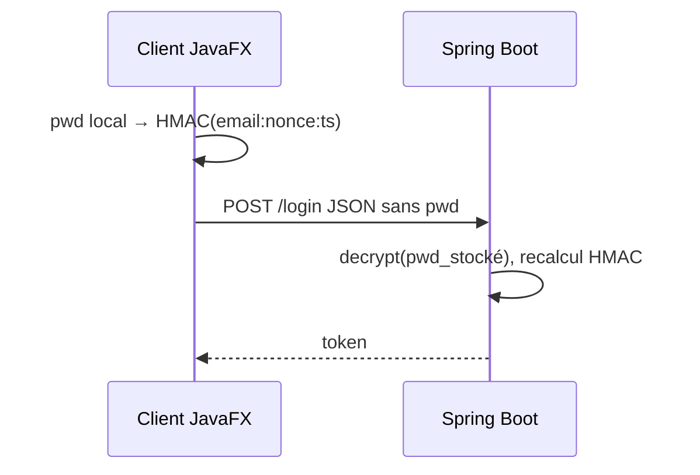

# TP3 — SSO : `email:nonce:timestamp` + HMAC-SHA256

Guide aligné sur **ton dépôt actuel** : login sans mot de passe en clair sur le réseau, stockage des mots de passe **chiffrés** (TP4) côté serveur.

---

## 1. Objectif pédagogique

Ne plus envoyer le **mot de passe en clair** dans le corps de `POST /api/auth/login`.

Le client calcule :

1. un **nonce** unique (souvent un UUID) ;
2. un **timestamp** (secondes depuis l’epoch Unix) ;
3. un **HMAC-SHA256** en **hex** sur le message `email:nonce:timestamp`, avec comme **clé** le mot de passe en UTF-8 (le mot de passe **ne quitte pas** la machine du client sous cette forme).

Le serveur :

1. retrouve l’utilisateur ;
2. vérifie **verrouillage**, **fenêtre temporelle**, **anti-rejeu** (nonce déjà vu) ;
3. **déchiffre** le mot de passe stocké (TP4) **en mémoire uniquement** ;
4. recalcule le HMAC et compare en **temps constant** ;
5. émet un **jeton** de session (UUID en base).

---

## 2. Contrat API

| Méthode | Chemin | Corps JSON | Réponse succès |
|--------|--------|------------|----------------|
| `POST` | `/api/auth/register` | `email`, `password`, `passwordConfirm` | **201** |
| `POST` | `/api/auth/login` | `email`, `nonce`, `timestamp`, `hmac` | **200** + `token` |
| `GET` | `/api/me` | en-tête `Authorization: Bearer …` | **200** |

Il n’y a **pas** d’endpoint « challenge » séparé : **un seul POST** pour se connecter.

---

## 3. Détails cryptographiques (à respecter à l’identique)

### 3.1 Normalisation de l’email

Même règle **côté client et serveur** :

- `trim()`
- `toLowerCase(Locale.ROOT)`

Références dans le code :

- **Serveur :** `AuthService.normalizeEmail`
- **Client :** `AuthApiClient.login` (`String em = email.trim().toLowerCase(Locale.ROOT)`)

### 3.2 Message signé

```text
message = normalizedEmail + ":" + nonce + ":" + timestampEpochSeconds
```

(`timestamp` est un **long** nombre de secondes, pas de millisecondes.)

### 3.3 HMAC

- Algorithme : **HmacSHA256**
- Clé : octets UTF-8 du **mot de passe en clair** (sur le client, saisi localement ; sur le serveur, obtenu **après déchiffrement** de `password_encrypted`).
- Sortie : chaîne **hexadécimal** (via `HexFormat.of().formatHex` en Java).

### 3.4 Comparaison côté serveur

Utiliser `SsoHmac.constantTimeEqualsHex(attendu, reçu)` pour éviter une comparaison courte-circuitée sur les chaînes.

---

## 4. Où est le code dans **ce** projet ?

| Rôle | Chemin |
|------|--------|
| DTO login TP3 | `authentification_back/.../dto/LoginRequest.java` |
| Service | `authentification_back/.../service/AuthService.java` |
| HMAC **backend** | `authentification_back/.../security/SsoHmac.java` |
| HMAC **frontend** | `authentification_front/.../security/SsoHmac.java` |
| Client HTTP | `authentification_front/.../api/AuthApiClient.java` |
| Nonce en base | `authentification_back/.../entity/AuthNonce.java` + `AuthNonceRepository` |

**Important :** il n’y a **plus** de module Maven `authentification-common`. Les deux fichiers `SsoHmac` sont **copies** ; si tu modifies l’algorithme d’un côté, tu **dois** reproduire la même logique de l’autre côté.

---

## 5. Configuration liée au TP3

Propriétés dans `application.properties` :

| Clé | Rôle |
|-----|------|
| `app.auth.timestamp-skew-seconds` | Tolérance max entre horloge client et serveur (défaut typique **60** s). |
| `app.auth.nonce-ttl-seconds` | Durée enregistrée sur la ligne `auth_nonce` après succès (TTL). |
| `app.auth.max-failed-attempts` / `app.auth.lock-duration` | **TP2** conservés : échecs HMAC comptent comme échecs de login. |

---

## 6. Anti-rejeu

Table **`auth_nonce`** :

- contrainte unique **`(user_id, nonce)`** ;
- avant de valider le HMAC, le service teste `exists\ByUserId\AndNonce` ;
- après succès, une ligne est insérée avec le nonce consommé.

Ainsi le **même** triple `(email, nonce, timestamp, hmac)` ne peut pas être rejoué.

---

## 7. Diagramme de séquence (résumé)



---

## 8. Migration SQL

Si tu migres une ancienne base « hash BCrypt » vers le modèle actuel, voir les scripts sous :

`authentification_back/src/main/resources/schema-mysql-migration-tp2-to-tp3.sql` (selon ton historique).

---

## 9. Pour aller plus loin

- **Guide projet (détail maximal) :** [GUIDE_PROJET_COMPLET.md](./GUIDE_PROJET_COMPLET.md)
- **Stockage chiffré (TP4) :** [GUIDE_TP4.md](./GUIDE_TP4.md)
