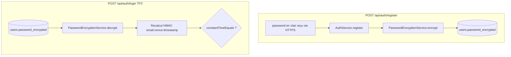

# TP4 — Guide ultra détaillé (Master Key + chiffrement mot de passe + CI)

Ce document est écrit pour que tu puisses **tout recoder toi-même** en comprenant le **pourquoi**, le **quoi**, et le **dans quel fichier**.

Pré-requis: lire d’abord [GUIDE_TP3](./GUIDE_TP3.md) pour le flux `nonce + timestamp + HMAC`.

---

## 1) Ce que TP4 change exactement

TP4 ne change pas la forme de l’API de login TP3 (`email`, `nonce`, `timestamp`, `hmac`).  
TP4 change surtout **la gestion du mot de passe côté serveur**:

1. On ne stocke plus le mot de passe en clair.
2. On ne stocke pas non plus un hash non réversible (car TP3 a besoin du secret clair pour recalculer le HMAC).
3. On stocke une version **chiffrée réversible** avec **AES-GCM**.
4. La clé maître de chiffrement vient de l’environnement: **`APP_MASTER_KEY`**.
5. Si `APP_MASTER_KEY` manque, l’app **doit refuser de démarrer**.

---

## 2) Architecture globale



Idée clé: **le mot de passe n’est en clair qu’en RAM, le temps d’une requête**.

---

## 3) Fichier principal à recoder: `PasswordEncryptionService.java`

**Fichier**:  
`authentification_back/src/main/java/com/example/authentification_back/security/PasswordEncryptionService.java`

### 3.1 Rôle

- Valider la présence de `APP_MASTER_KEY` au démarrage.
- Dériver une clé AES-256 depuis cette master key.
- Chiffrer au format versionné: `v1:Base64(iv):Base64(ciphertext)`.
- Déchiffrer ce format.
- Garder une compatibilité legacy (ancien format concaténé).

### 3.2 Extrait commenté (constructeur + validation)

```java
// Fichier: security/PasswordEncryptionService.java
public PasswordEncryptionService(@Value("${APP_MASTER_KEY:}") String appMasterKey) {
    // 1) Si variable absente ou vide => on bloque le démarrage
    if (appMasterKey == null || appMasterKey.isBlank()) {
        throw new IllegalStateException(
            "Variable d'environnement APP_MASTER_KEY obligatoire : définissez une clé maître (jamais en dur dans le code).");
    }

    // 2) On dérive une clé AES-256 (32 octets) via SHA-256
    //    => la master key textuelle n'est jamais utilisée directement comme clé AES brute
    byte[] keyBytes = sha256(appMasterKey.getBytes(StandardCharsets.UTF_8));
    this.aesKey = new SecretKeySpec(keyBytes, "AES");
}
```

### 3.3 Extrait commenté (encrypt)

```java
// Fichier: security/PasswordEncryptionService.java
public String encrypt(String plainPassword) {
    try {
        byte[] iv = new byte[GCM_IV_LENGTH];
        new SecureRandom().nextBytes(iv); // IV unique à chaque chiffrement

        Cipher cipher = Cipher.getInstance("AES/GCM/NoPadding");
        cipher.init(Cipher.ENCRYPT_MODE, aesKey, new GCMParameterSpec(GCM_TAG_LENGTH, iv));

        byte[] cipherText = cipher.doFinal(plainPassword.getBytes(StandardCharsets.UTF_8));

        // Format versionné pour faciliter futures migrations
        String ivB64 = Base64.getEncoder().encodeToString(iv);
        String ctB64 = Base64.getEncoder().encodeToString(cipherText);
        return "v1:" + ivB64 + ":" + ctB64;
    } catch (Exception e) {
        throw new IllegalStateException("Chiffrement impossible", e);
    }
}
```

### 3.4 Extrait commenté (decrypt + intégrité)

```java
// Fichier: security/PasswordEncryptionService.java
private String decryptV1(String stored) {
    try {
        String payload = stored.substring("v1:".length());
        int sep = payload.indexOf(':');
        if (sep < 0) {
            throw new IllegalStateException("Format v1 invalide");
        }

        byte[] iv = Base64.getDecoder().decode(payload.substring(0, sep));
        byte[] cipherText = Base64.getDecoder().decode(payload.substring(sep + 1));

        Cipher cipher = Cipher.getInstance("AES/GCM/NoPadding");
        cipher.init(Cipher.DECRYPT_MODE, aesKey, new GCMParameterSpec(GCM_TAG_LENGTH, iv));

        // Si ciphertext modifié, GCM déclenche une exception (tag invalide)
        byte[] plain = cipher.doFinal(cipherText);
        return new String(plain, StandardCharsets.UTF_8);
    } catch (Exception e) {
        throw new IllegalStateException("Déchiffrement impossible", e);
    }
}
```

---

## 4) Brancher ce service dans `AuthService.java`

**Fichier**:  
`authentification_back/src/main/java/com/example/authentification_back/service/AuthService.java`

### 4.1 Inscription: chiffrer avant `save`

```java
// Fichier: service/AuthService.java
public UserResponse register(RegisterRequest request) {
    // ... validations email/password ...
    User user = new User();
    user.setEmail(email);

    // TP4: on persiste uniquement la version chiffrée
    user.setPasswordEncrypted(passwordEncryptionService.encrypt(request.password()));

    userRepository.save(user);
    return UserResponse.profile(user);
}
```

### 4.2 Login: déchiffrer avant recalcul HMAC

```java
// Fichier: service/AuthService.java
public UserResponse login(LoginRequest request) {
    // ... vérifications email, lock, timestamp, nonce ...

    String plainPassword;
    try {
        // Le mot de passe est reconstitué uniquement en mémoire
        plainPassword = passwordEncryptionService.decrypt(user.getPasswordEncrypted());
    } catch (Exception e) {
        throw new AuthenticationFailedException(GENERIC_LOGIN_ERROR);
    }

    String message = SsoHmac.messageToSign(email, request.nonce(), request.timestamp());
    String expectedHex = SsoHmac.hmacSha256Hex(plainPassword, message);
    if (!SsoHmac.constantTimeEqualsHex(expectedHex, request.hmac())) {
        registerFailureAndThrow(user, email, now);
    }

    // ... succès login ...
}
```

---

## 5) Compte de démo: adapter à `password_encrypted`

**Fichier**:  
`authentification_back/src/main/java/com/example/authentification_back/config/TestAccountInitializer.java`

```java
// Fichier: config/TestAccountInitializer.java
@Override
public void run(String... args) {
    if (userRepository.existsByEmail(TEST_EMAIL)) {
        return;
    }
    User user = new User();
    user.setEmail(TEST_EMAIL);
    // Important: on chiffre même pour le compte seed
    user.setPasswordEncrypted(passwordEncryptionService.encrypt(TEST_PASSWORD_PLAIN));
    userRepository.save(user);
}
```

---

## 6) Configuration locale: `APP_MASTER_KEY`

### 6.1 Côté code de config

**Fichier**:  
`authentification_back/src/main/resources/application.properties`

On laisse des commentaires mais **pas de vraie clé en dur**.

Extrait recommandé:

```properties
# --- TP4 : Master Key ---
# Sans APP_MASTER_KEY, Spring ne peut pas créer PasswordEncryptionService.
# Ne pas mettre la vraie clé ici: la fournir via l'environnement.
```

### 6.2 Lancer en local (Windows PowerShell)

```powershell
$env:APP_MASTER_KEY = "ta-cle-longue-aleatoire"
mvn spring-boot:run
```

### 6.3 IntelliJ / Cursor run configuration

Dans `Environment variables`:

```text
APP_MASTER_KEY=ta-cle-longue-aleatoire
```

Si absent: erreur au boot `IllegalStateException` (comportement attendu TP4).

---

## 7) Base de données et format stocké

La colonne utilisée est `users.password_encrypted`.  
Exemple de valeur en base:

```text
v1:7wQmy8hF7Y4s3f4N:5YQ0xg0H7c... (tronqué)
```

- `v1` = version du format.
- premier bloc = IV (Base64).
- second bloc = ciphertext + tag GCM (Base64).

Pourquoi versionner? pour autoriser un futur `v2` sans casser les anciennes lignes.

---

## 8) Tests à implémenter et comprendre

### 8.1 Tests unitaires chiffrement

**Fichier**:  
`authentification_back/src/test/java/com/example/authentification_back/security/PasswordEncryptionServiceTest.java`

Cas importants:

1. constructeur rejette clé vide/blanche.
2. `encrypt -> decrypt` restitue exactement le plaintext.
3. ciphertext différent du plaintext.
4. ciphertext altéré => échec decrypt.

### 8.2 Test de démarrage Spring

**Fichier**:  
`authentification_back/src/test/java/com/example/authentification_back/ApplicationMasterKeyStartupTest.java`

Objectif: vérifier que le contexte échoue sans `APP_MASTER_KEY`.

---

## 9) Pipeline GitHub Actions détaillé

**Fichier**:  
`.github/workflows/ci.yml`

Extrait:

```yaml
name: CI
on:
  push:
    branches: [main]
  pull_request:
    branches: [main]

jobs:
  build:
    runs-on: ubuntu-latest
    steps:
      - uses: actions/checkout@v4
        with:
          fetch-depth: 0
      - uses: actions/setup-java@v4
        with:
          distribution: temurin
          java-version: "21"
          cache: maven
      - name: Maven verify + SonarCloud
        env:
          APP_MASTER_KEY: test_master_key_for_ci_only
          SONAR_TOKEN: ${{ secrets.SONAR_TOKEN }}
        run: mvn -B verify sonar:sonar -Dsonar.token=${SONAR_TOKEN}
```

Points pédagogiques:

- `APP_MASTER_KEY` factice en CI: nécessaire pour ne pas casser le boot.
- `SONAR_TOKEN` vient des secrets GitHub, jamais du repo.
- `verify` exécute compilation + tests + checks Maven.

---

## 10) Procédure “je recode TP4 de zéro”

Ordre conseillé:

1. Créer `PasswordEncryptionService` (validation env + encrypt/decrypt).
2. Remplacer `passwordHash` / `password` par `passwordEncrypted` côté entité + service.
3. Modifier `AuthService.register` pour chiffrer à l’écriture.
4. Modifier `AuthService.login` pour déchiffrer avant HMAC.
5. Mettre à jour `TestAccountInitializer`.
6. Vérifier `application.properties` (pas de clé hardcodée).
7. Écrire tests unitaires chiffrement + test startup.
8. Ajouter/valider workflow CI (`APP_MASTER_KEY` factice + Sonar).
9. Lancer local avec variable d’environnement.

---

## 11) Erreurs fréquentes et diagnostic rapide

1. **Erreur boot `APP_MASTER_KEY obligatoire`**
   - cause: variable absente dans la config Run/Debug.
   - fix: ajouter `APP_MASTER_KEY` dans l’environnement du process Java.

2. **Le login TP3 échoue alors que l’utilisateur existe**
   - cause possible: mot de passe chiffré avec une autre master key.
   - fix: garder la même master key pour déchiffrer les données existantes.

3. **Déchiffrement impossible**
   - cause: donnée `password_encrypted` corrompue / format invalide.
   - fix: vérifier format `v1:...:...` en base.

4. **CI rouge sur Sonar**
   - cause: secret `SONAR_TOKEN` absent.
   - fix: créer le secret GitHub Actions.

---

## 12) Liens utiles du projet

| Élément | Chemin |
|---------|--------|
| Guide TP3 | [`./GUIDE_TP3.md`](./GUIDE_TP3.md) |
| Service chiffrement | `authentification_back/src/main/java/com/example/authentification_back/security/PasswordEncryptionService.java` |
| Service auth | `authentification_back/src/main/java/com/example/authentification_back/service/AuthService.java` |
| Seed compte test | `authentification_back/src/main/java/com/example/authentification_back/config/TestAccountInitializer.java` |
| Config backend | `authentification_back/src/main/resources/application.properties` |
| CI | [`../../.github/workflows/ci.yml`](../../.github/workflows/ci.yml) |
| README backend | [`../../authentification_back/README.md`](../../authentification_back/README.md) |

---

Si tu veux, je peux enchaîner avec une **version “TP4 recodé pas à pas” encore plus guidée**, où je te donne chaque classe dans l’ordre avec un mini-exercice (à compléter) puis la correction.
