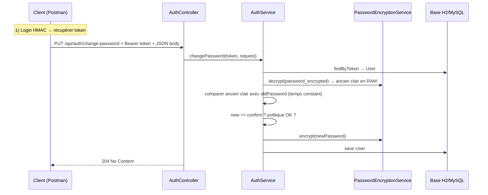

# Guide détaillé TP5 — changement de mot de passe, Docker, CI

Ce document explique **tout ce qui a été ajouté** pour le TP5 dans ton dépôt : rôle de chaque fichier, **logique métier**, **comment tester** (Postman), et **comment utiliser Docker Desktop** sous Windows.

---

## Table des matières

1. [Ce que le TP5 ajoute au projet](#1-ce-que-le-tp5-ajoute-au-projet)
2. [Vue d’ensemble du flux « changement de mot de passe »](#2-vue-densemble-du-flux-changement-de-mot-de-passe)
3. [Fichiers créés ou modifiés](#3-fichiers-créés-ou-modifiés)
4. [Code et implémentation commentée](#4-code-et-implémentation-commentée)
5. [Contrat API et exemples Postman](#5-contrat-api-et-exemples-postman)
6. [Tests automatisés (JUnit)](#6-tests-automatisés-junit)
7. [Docker : concepts rapides](#7-docker--concepts-rapides)
8. [Docker Desktop sur Windows — installation et réglages](#8-docker-desktop-sur-windows--installation-et-réglages)
9. [Construire et lancer l’image (ligne de commande)](#9-construire-et-lancer-limage-ligne-de-commande)
10. [Utiliser Docker Desktop (interface graphique)](#10-utiliser-docker-desktop-interface-graphique)
11. [Pièges fréquents et dépannage](#11-pièges-fréquents-et-dépannage)
12. [Intégration continue (GitHub Actions)](#12-intégration-continue-github-actions)

---

## 1. Ce que le TP5 ajoute au projet

| Livrable | Description |
|----------|-------------|
| **Endpoint REST** | `PUT /api/auth/change-password` : utilisateur déjà connecté (jeton) peut remplacer son mot de passe. |
| **Sécurité** | Même esprit que TP4 : ancien mot de passe vérifié, nouveau conforme à la **politique** (`PasswordPolicyValidator`), stockage **chiffré** via `PasswordEncryptionService` et **`APP_MASTER_KEY`**. |
| **Tests** | Cinq scénarios d’intégration minimum (succès, ancien faux, confirmation différente, mot de passe faible, token invalide). |
| **Docker** | `Dockerfile` à la **racine** du dépôt : construit une image qui exécute le JAR Spring Boot. |
| **`.dockerignore`** | Réduit le contexte envoyé à Docker (évite `.git`, `target`, etc.). |
| **CI** | Après `mvn verify` + Sonar, la pipeline lance **`docker build`**. |

**Non inclus** : écran JavaFX dédié au changement de mot de passe. Tu peux tout tester avec **Postman** (ou curl). Le front existant reste centré sur inscription / connexion HMAC / profil.

---

## 2. Vue d’ensemble du flux « changement de mot de passe »



**Points importants :**

- L’**authentification** du appel se fait via le **même mécanisme** que `/api/me` : en-tête `Authorization: Bearer <token>` ou `X-Auth-Token`.
- Le **mot de passe stocké** est toujours le champ chiffré `password_encrypted` (TP4). On **déchiffre** pour comparer l’ancien, puis on **rechiffre** le nouveau.

---

## 3. Fichiers créés ou modifiés

| Fichier | Action |
|---------|--------|
| `authentification_back/.../dto/ChangePasswordRequest.java` | **Créé** — corps JSON validé (`@NotBlank`). |
| `authentification_back/.../service/AuthService.java` | **Modifié** — méthodes `changePassword`, `requireUserByToken`, `constantTimeEqualsUtf8`. |
| `authentification_back/.../controller/AuthController.java` | **Modifié** — mapping `PUT /auth/change-password`. |
| `authentification_back/.../AuthApiIntegrationTest.java` | **Modifié** — 5 tests TP5 + helpers `changePasswordJson`, `loginAndExtractToken`. |
| `Dockerfile` | **Créé** (racine du dépôt). |
| `.dockerignore` | **Créé** (racine). |
| `.github/workflows/ci.yml` | **Modifié** — étape `docker build`. |

---

## 4. Code et implémentation commentée

### 4.1 DTO `ChangePasswordRequest`

**Chemin :** `authentification_back/src/main/java/com/example/authentification_back/dto/ChangePasswordRequest.java`

```java
package com.example.authentification_back.dto;

import jakarta.validation.constraints.NotBlank;

/**
 * TP5 — corps JSON pour {@code PUT /api/auth/change-password}.
 * Record = classe immuable adaptée au JSON ; les accessors sont oldPassword(), newPassword(), confirmPassword().
 */
public record ChangePasswordRequest(
		@NotBlank(message = "L'ancien mot de passe est obligatoire")
		String oldPassword,
		@NotBlank(message = "Le nouveau mot de passe est obligatoire")
		String newPassword,
		@NotBlank(message = "La confirmation du mot de passe est obligatoire")
		String confirmPassword
) {
}
```

**Rôle :** Spring + Hibernate Validator rejettent tout champ vide avec **400 Bad Request** avant d’entrer dans le service (via `@Valid` sur le contrôleur).

---

### 4.2 Contrôleur `AuthController`

**Chemin :** `authentification_back/src/main/java/com/example/authentification_back/controller/AuthController.java`

Extrait du endpoint TP5 :

```java
/** TP5 — authentification requise (Bearer ou {@code X-Auth-Token}). */
@PutMapping("/auth/change-password")
public ResponseEntity<Void> changePassword(
		@RequestHeader(value = HttpHeaders.AUTHORIZATION, required = false) String authorization,
		@RequestHeader(value = "X-Auth-Token", required = false) String authToken,
		@Valid @RequestBody ChangePasswordRequest request) {
	// resolveToken réutilise la même logique que /api/me : "Bearer xxx" ou jeton brut / X-Auth-Token
	authService.changePassword(resolveToken(authorization, authToken), request);
	// 204 = succès sans corps (standard pour une action qui ne renvoie pas de représentation)
	return ResponseEntity.noContent().build();
}
```

**Réponses HTTP typiques :**

| Situation | Code |
|-----------|------|
| Succès | **204 No Content** |
| Jeton absent / invalide | **401 Unauthorized** (`AuthenticationFailedException`) |
| Ancien mot de passe incorrect | **401** (même message générique que le login, pour ne pas divulguer trop d’info) |
| new ≠ confirm | **400** (`InvalidInputException`) |
| Politique mot de passe non respectée | **400** |

---

### 4.3 Service `AuthService.changePassword`

**Chemin :** `authentification_back/src/main/java/com/example/authentification_back/service/AuthService.java`

```java
/**
 * TP5 — changement de mot de passe pour un utilisateur identifié par son jeton de session.
 */
@Transactional
public void changePassword(String rawToken, ChangePasswordRequest request) {
	// 1) Charger l'utilisateur par token (comme /api/me) — sinon 401
	User user = requireUserByToken(rawToken);

	// 2) Déchiffrer le mot de passe actuel depuis la colonne password_encrypted (TP4)
	String currentPlain;
	try {
		currentPlain = passwordEncryptionService.decrypt(user.getPasswordEncrypted());
	} catch (Exception e) {
		log.warn("Déchiffrement impossible pour user id={}", user.getId());
		throw new AuthenticationFailedException(GENERIC_LOGIN_ERROR);
	}

	// 3) Vérifier l'ancien mot de passe saisi — comparaison en temps constant sur octets UTF-8
	if (!constantTimeEqualsUtf8(currentPlain, request.oldPassword())) {
		log.warn("Changement mot de passe refusé: ancien mot de passe invalide user id={}", user.getId());
		throw new AuthenticationFailedException(GENERIC_LOGIN_ERROR);
	}
	// 4) Cohérence nouveau / confirmation
	if (!request.newPassword().equals(request.confirmPassword())) {
		throw new InvalidInputException("Les mots de passe ne correspondent pas");
	}

	// 5) Règles métier TP2 (12 car., maj, min, chiffre, spécial)
	passwordPolicyValidator.assertCompliant(request.newPassword());
	// 6) Chiffrement + persistance
	user.setPasswordEncrypted(passwordEncryptionService.encrypt(request.newPassword()));
	userRepository.save(user);
	log.info("Changement mot de passe réussi user id={}", user.getId());
}
```

**`constantTimeEqualsUtf8` :** utilise `MessageDigest.isEqual` sur les tableaux d’octets UTF-8 pour limiter les attaques par **timing** (comparaison naïve `String.equals` peut fuiter la longueur ou des préfixes en théorie).

**`requireUserByToken` :** factorise la résolution `findByToken` ; si le token est absent ou inconnu → **401**.

---

## 5. Contrat API et exemples Postman

### 5.1 Obtenir un jeton (rappel TP3)

1. **POST** `http://localhost:8080/api/auth/login`  
2. Corps JSON (exemple avec nonce / timestamp / hmac calculés comme le client) — ou utilise le compte seed `toto@example.com` / `Pwd1234!abcd` avec le même calcul HMAC que dans les tests.  
3. Copier **`token`** dans la réponse.

Pour un test rapide, tu peux t’inspirer des tests : message signé `email:nonce:timestamp`, HMAC-SHA256 hex avec le mot de passe en clé.

### 5.2 Changer le mot de passe

1. **PUT** `http://localhost:8080/api/auth/change-password`
2. **Headers :**
   - `Content-Type: application/json`
   - `Authorization: Bearer <coller_le_token>`  
     *(ou header `X-Auth-Token` avec la valeur du token sans préfixe Bearer)*
3. **Body** (raw JSON) :

```json
{
  "oldPassword": "Pwd1234!abcd",
  "newPassword": "Zz9!zzzzzzzzzz",
  "confirmPassword": "Zz9!zzzzzzzzzz"
}
```

4. Réponse attendue : **204 No Content** (corps vide).

**Important :** l’application **doit** avoir **`APP_MASTER_KEY`** définie au démarrage (variable d’environnement), sinon elle ne démarre pas (TP4).

---

## 6. Tests automatisés (JUnit)

**Fichier :** `authentification_back/src/test/java/com/example/authentification_back/AuthApiIntegrationTest.java`

| Test | Ce qui est vérifié |
|------|---------------------|
| `change_passwordsuccess_then_old_login_fails_and_new_login_works` | Après changement, login HMAC avec **ancien** mot de passe échoue, avec **nouveau** réussit. |
| `change_password_rejects_when_old_password_is_wrong` | **401** si ancien incorrect. |
| `change_password_rejects_when_confirmation_differs` | **400** si new ≠ confirm. |
| `change_password_rejects_weak_new_password` | **400** si politique non respectée. |
| `change_password_rejects_invalid_user_or_token` | **401** si Bearer fictif. |

Commande typique (depuis le dossier contenant `mvnw`, avec JDK 17 pour le back) :

```powershell
cd "D:\tp\spring boot\authentification\authentification_back"
$env:JAVA_HOME = "C:\Program Files\Java\jdk-17"
$env:Path = "$env:JAVA_HOME\bin;$env:Path"
.\mvnw.cmd -f ..\pom.xml -pl authentification_back -am test
```

---

## 7. Docker : concepts rapides

| Terme | Signification |
|-------|----------------|
| **Image** | Modèle immuable (OS léger + JRE + ton JAR). Construite par `docker build`. |
| **Conteneur** | Instance **en cours d’exécution** d’une image (`docker run`), avec ses variables d’environnement et le mapping de ports. |
| **Dockerfile** | Recette : étapes `FROM`, `COPY`, `RUN`, `EXPOSE`, `ENTRYPOINT`. |
| **Contexte de build** | Dossier envoyé au démon Docker ; `.dockerignore` **exclut** des fichiers pour accélérer et sécuriser. |

Ton `Dockerfile` est en **deux étapes** (**multi-stage**) :

1. **Stage `builder`** : image Maven + JDK 21 → compile le module `authentification_back` (et le parent POM) avec `mvn package -DskipTests`.  
2. **Stage final** : petite image **JRE 17** → copie uniquement le JAR, lance `java -jar`.

**Pourquoi deux étapes ?** Tu n’embarques pas Maven ni les sources dans l’image finale : image plus **légère** et plus **sûre** pour la prod.

---

## 8. Docker Desktop sur Windows — installation et réglages

### 8.1 Prérequis

- Windows 10/11 **64 bits**.
- Virtualisation activée dans le BIOS (Intel VT-x / AMD-V).
- Si demandé : installer / activer **WSL 2** (Windows Subsystem for Linux) — Docker Desktop s’appuie souvent dessus.

### 8.2 Installation

1. Télécharge **Docker Desktop for Windows** sur le site officiel de Docker.
2. Installe en laissant les options par défaut (intégration WSL 2 recommandée).
3. **Redémarre** si l’installateur le demande.
4. Lance **Docker Desktop** ; attends que l’icône dauphin indique **« Docker is running »**.

### 8.3 Vérifications utiles

- **Settings → Resources** : CPU / RAM alloués aux conteneurs (par défaut souvent suffisant pour Spring Boot).
- **Settings → General** : coche « Use the WSL 2 based engine » si disponible.
- Ouvre **PowerShell** ou **CMD** et tape :

```powershell
docker version
docker info
```

Si ces commandes répondent sans erreur, le CLI parle au démon Docker Desktop.

---

## 9. Construire et lancer l’image (ligne de commande)

### 9.1 Se placer à la racine du dépôt

```powershell
cd "D:\tp\spring boot\authentification"
```

Le `Dockerfile` et le `pom.xml` parent doivent être **dans ce répertoire courant** lors du `docker build` (c’est le contexte).

### 9.2 Construire l’image

```powershell
docker build -t cdwfs-auth-app .
```

- **`-t cdwfs-auth-app`** : nom (tag) lisible pour l’image (aligné sur l’énoncé / schéma du cours).
- **`.`** : contexte = dossier courant (respecte `.dockerignore`).

La première fois, Docker **télécharge** les images de base `maven:...` et `eclipse-temurin:17-jre` ; ça peut prendre plusieurs minutes.

### 9.3 Lancer un conteneur

```powershell
docker run --rm -p 8080:8080 -e APP_MASTER_KEY=test_master_key cdwfs-auth-app
```

| Option | Rôle |
|--------|------|
| `--rm` | Supprime le conteneur quand tu arrêtes le process (pratique en dev). |
| `-p 8080:8080` | Port **hôte** 8080 → port **conteneur** 8080 (`EXPOSE 8080` dans le Dockerfile). |
| `-e APP_MASTER_KEY=...` | **Obligatoire** : sans ça, `PasswordEncryptionService` fait échouer le démarrage. |

Puis ouvre `http://localhost:8080` (les endpoints sont sous `/api/...`).

### 9.4 Arrêter

Dans le terminal : **Ctrl+C**. Avec `--rm`, le conteneur disparaît.

### 9.5 MySQL et Docker

L’image **ne contient pas MySQL**. Par défaut, ton `application.properties` pointe vers MySQL local. En Docker, sans base joignable au réseau du conteneur, l’app peut échouer au démarrage.

**Options :**

- Utiliser une **URL JDBC** vers une base accessible depuis le conteneur (variables `SPRING_DATASOURCE_*`), ou
- Pour un test minimal : profil avec H2 (nécessiterait une adaptation pour l’image — hors scope du TP si le prof attend MySQL).

En **TP / démo** souvent : même machine, MySQL sur l’hôte : utiliser `host.docker.internal` comme hôte JDBC (Docker Desktop Windows le fournit). Exemple d’override (à adapter) :

```powershell
docker run --rm -p 8080:8080 `
  -e APP_MASTER_KEY=test_master_key `
  -e SPRING_DATASOURCE_URL=jdbc:mysql://host.docker.internal:3307/authentification?useSSL=false&allowPublicKeyRetrieval=true&serverTimezone=UTC `
  -e SPRING_DATASOURCE_USERNAME=root `
  -e SPRING_DATASOURCE_PASSWORD=ton_mot_de_passe `
  cdwfs-auth-app
```

*(Adapte port 3307, user, mot de passe à ton installation.)*

---

## 10. Utiliser Docker Desktop (interface graphique)

1. Onglet **Images** : tu dois voir `cdwfs-auth-app` après un `docker build`.
2. Clique **Run** (ou « Play ») sur l’image :
   - **Optional settings** → **Ports** : `8080:8080`
   - **Environment variables** : ajoute `APP_MASTER_KEY` = `test_master_key` (ou ta clé)
   - Ajoute éventuellement les variables `SPRING_DATASOURCE_*` si tu utilises MySQL sur l’hôte.
3. **Containers** : le conteneur doit passer à **running** ; tu peux ouvrir les **logs** en un clic.
4. Pour arrêter : bouton **Stop** sur le conteneur.

---

## 11. Pièges fréquents et dépannage

| Problème | Piste |
|----------|--------|
| `docker: error during connect` | Docker Desktop n’est pas démarré. |
| Build très lent | Normal au premier run (téléchargement des layers Maven). |
| App crash au boot « APP_MASTER_KEY obligatoire » | Oublie de `-e APP_MASTER_KEY=...` sur `docker run`. |
| Connexion MySQL refusée depuis le conteneur | Utiliser `host.docker.internal` ou un réseau Docker partagé avec un service MySQL. |
| Port 8080 déjà utilisé | Arrête l’autre process ou mappe `-p 8081:8080` et appelle `http://localhost:8081`. |

---

## 12. Intégration continue (GitHub Actions)

**Fichier :** `.github/workflows/ci.yml`

Après :

```yaml
run: mvn -B verify sonar:sonar -Dsonar.token=${SONAR_TOKEN}
```

une étape :

```yaml
- name: Build Docker image
  run: docker build -t cdwfs-auth-app:ci .
```

Les runners GitHub ont Docker disponible : si **`mvn verify`** est vert, **`docker build`** valide que le `Dockerfile` est cohérent. En cas d’échec, la PR est rouge.

---

## Synthèse

- **TP5 fonctionnel côté code** : endpoint + service + DTO + tests + Docker + CI.  
- **Test manuel** : Postman + token Bearer + `PUT /api/auth/change-password`.  
- **Docker Desktop** : construire à la racine, lancer avec **`APP_MASTER_KEY`**, gérer **MySQL** si tu exécutes l’image hors d’un environnement déjà configuré.

Pour le détail du reste du projet (HMAC, chiffrement, structure Maven), voir aussi **[GUIDE_PROJET_COMPLET.md](./GUIDE_PROJET_COMPLET.md)**.
